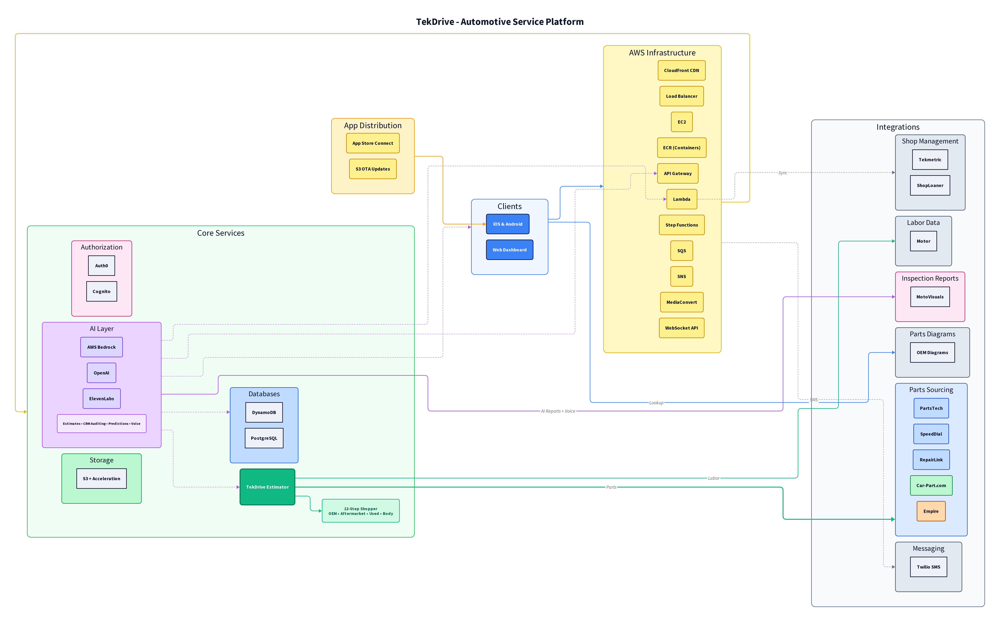

# TekDrive System Architecture

This diagram provides a high-level overview of TekDrive's full-stack platform architecture.

---

## Architecture Overview

### Clients
- **iOS & Android** - Native mobile applications for technicians, porters, and service advisors
- **Web Dashboard** - Browser-based interface for management and reporting

### App Distribution
- **App Store Connect** - iOS app distribution via Apple's official channel
- **S3 OTA Updates** - Android app distribution via self-hosted over-the-air updates

### AWS Infrastructure
| Service | Purpose |
|---------|---------|
| CloudFront CDN | Content delivery and edge caching |
| Load Balancer | Traffic distribution across EC2 instances |
| EC2 | Compute instances for backend services |
| ECR | Docker container registry |
| API Gateway | REST API management (Lambda + Step Functions) |
| Lambda | Serverless function execution |
| Step Functions | Workflow orchestration |
| SQS | Message queuing |
| SNS | Push notifications and alerts |
| MediaConvert | Video processing and transcoding |
| WebSocket API | Real-time bidirectional communication |

### Core Services

#### Authorization
- **Auth0** - OAuth 2.0 identity provider
- **Cognito** - AWS user pool management

#### AI Layer
| Provider | Use Cases |
|----------|-----------|
| AWS Bedrock | CRM auditing, predictions |
| OpenAI | Estimate generation, intelligent parts shopping |
| ElevenLabs | Voice synthesis for inspection reports |

#### Storage & Databases
- **S3 + Transfer Acceleration** - Media file storage with optimized upload speeds
- **DynamoDB** - Real-time data, session management, rate limiting
- **PostgreSQL** - Relational data, historical records, CRM

#### TekDrive Estimator
Proprietary 12-step parts and labor shopping engine that queries multiple sources to optimize gross profit:
- OEM parts
- Aftermarket parts
- Used parts
- Body parts

### External Integrations

#### Shop Management
- Tekmetric
- ShopLoaner

#### Labor Data
- Motor (labor times)

#### Inspection Reports
- MotoVisuals (AI-powered with ElevenLabs voice)

#### Parts Diagrams
- OEM Diagrams (user lookup)

#### Parts Sourcing
| Source | Type |
|--------|------|
| PartsTech | OEM + Aftermarket |
| SpeedDial | OEM + Aftermarket |
| RepairLink | OEM + Aftermarket |
| Car-Part.com | Used Parts |
| Empire | Body Parts |

#### Messaging
- Twilio (Two-way SMS)

---

## Key Architectural Highlights

1. **AI-Integrated Throughout** - Bedrock, OpenAI, and ElevenLabs power estimates, CRM predictions, and voice-enabled inspection reports

2. **Multi-Source Parts Shopping** - The TekDrive Estimator queries 5+ parts sources simultaneously to find optimal pricing

3. **Real-Time Updates** - WebSocket API enables live status updates across all connected clients

4. **Serverless + Containerized** - Hybrid approach using Lambda for event-driven tasks and EC2/ECR for persistent workloads

5. **Video Processing Pipeline** - MediaConvert handles video transcoding for inspection recordings

---

## IP Protection Notice

This diagram is for demonstration purposes only. It illustrates high-level component relationships without exposing proprietary implementation details, API specifications, or internal business logic.

**TekDrive™** is the intellectual property of Justin McKinney / TekDrive LLC.
